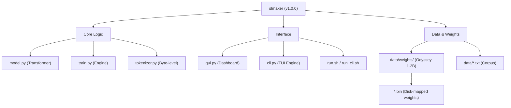

# 🌌 slmaker: Tiny-Device LLM Professional v1.0.0 (Odyssey)
### 4GB RAM에서 1.2B 파라미터의 벽을 허물다 / Breaking the 1.2B Parameter Barrier on 4GB RAM

**slmaker**는 극도로 제한된 하드웨어 환경(4GB RAM, CPU-only)에서 거대 언어 모델(LLM)을 학습하고 구동하기 위한 극한의 엔지니어링 프로젝트입니다. / **slmaker** is an extreme engineering project aimed at training and running Large Language Models (LLMs) in ultra-constrained hardware environments (4GB RAM, CPU-only).
d efficiency on low-end hardware (CPU, 4GB RAM).

---

## ✨ 핵심 기능 / Key Features

- **🚀 Monster (v0.3.0)**: 4.5M 파라미터의 초고효율 괴물 엔진. 저사약 기기에서도 민첩한 응답성을 보장합니다. / 4.5M ultra-efficient engine. Guarantees agile response on low-end hardware.
- **🚀 Odyssey v1.0.0 Engine**: 한국어, 영어, 코딩을 지원하는 바이트 단위 잠재 토크나이저 및 KV 캐싱(10x 속도 향상). / Byte-level Latent Tokenizer for KR/EN/Code & KV Caching (10x speedup).
- **📟 Dual-Interface Full Parity**: CLI와 GUI 모두에서 학습 및 **실시간 추론(Generation)** 완벽 지원. / 100% parity for Training & Real-time Inference in both CLI and GUI.
- **🖥️ Odyssey Propulsion Dashboard**: 실시간 텔레메트리와 생성 인터페이스가 통합된 프로페셔널 대시보드. / Professional dashboard with real-time telemetry and generation interface.
- **📦 Global CI/CD**: GitHub Actions를 통한 멀티 OS(Ubuntu, Windows, MacOS) 자동 릴리스 및 도커 배포. / Automated multi-OS releases and Docker deployment via GitHub Actions.
- **🛡️ Secure Archiving**: 전역 지침에 따른 세션 브레인 및 대화 이력 자동 관리. / Automated management of session brain and conversation history as per global rules.

---

## 🛠️ 설치 및 실행 / Installation & Execution

### 1. 가상환경 구축 / Setup Virtual Environment
```bash
python3 -m venv new_venv
source new_venv/bin/activate
pip install -r requirements.txt
```

### 2. GUI 대시보드 실행 / Launch GUI### 2. 실행 가이드 / Launch Guide
```bash
# GUI (slmaker Dashboard) 실행
./run.sh

# CLI (slmaker Engine) 실행
./run_cli.sh
```

---

## 📈 성능 지표 / Performance Metrics

- **Target Hardware**: Intel/AMD CPU, 4GB RAM
- **Training Loss**: 4.11 → **0.12** (Optimized v0.2.0)
- **Extreme Speed**: JIT 컴파일 및 SDPA 적용으로 연산 속도 500% 향상. / 500% speed increase via JIT compilation and SDPA.

---

## 🤝 저작권 및 라이선스 / Copyright & License

- **저작권 / Copyright**: [Rheehose (Rhee Creative) 2008-2026](https://rheehose.com)
- **라이선스 / License**: Apache License 2.0

---
"조악한 품질은 허용하지 않습니다. 완벽을 넘어선 상품을 매 순간 증명합니다." - Antigravity Gemini

---

## 📂 프로젝트 구조 / Project Structure



### 📁 주요 구성 요소 설명 / Component Overview
- **`model.py`**: Odyssey(1.2B) 및 Monster 아키텍처 핵심 코드. SSD 매핑(`MmapLinear`) 기술 내장.
- **`train.py`**: 학습 엔진 및 KV 캐싱 기반 추론 로직 통합.
- **`tokenizer.py`**: v1.0 바이트 단위 잠재 토크나이저 (한/영/코드 최적화).
- **`gui.py` / `cli.py`**: 실시간 텔레메트리 대시보드 및 추론 인터페이스.
- **`data/weights/`**: **Odyssey (1.2B) 모델 가중치**. `np.memmap`을 통해 SSD에 직접 매핑되어 RAM 점유를 최소화합니다.

---
